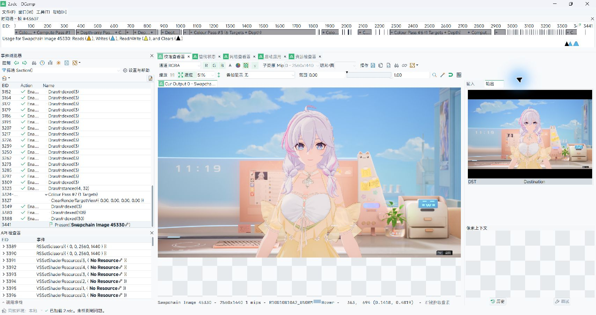
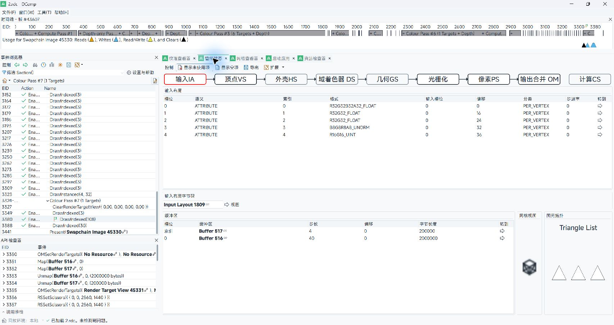
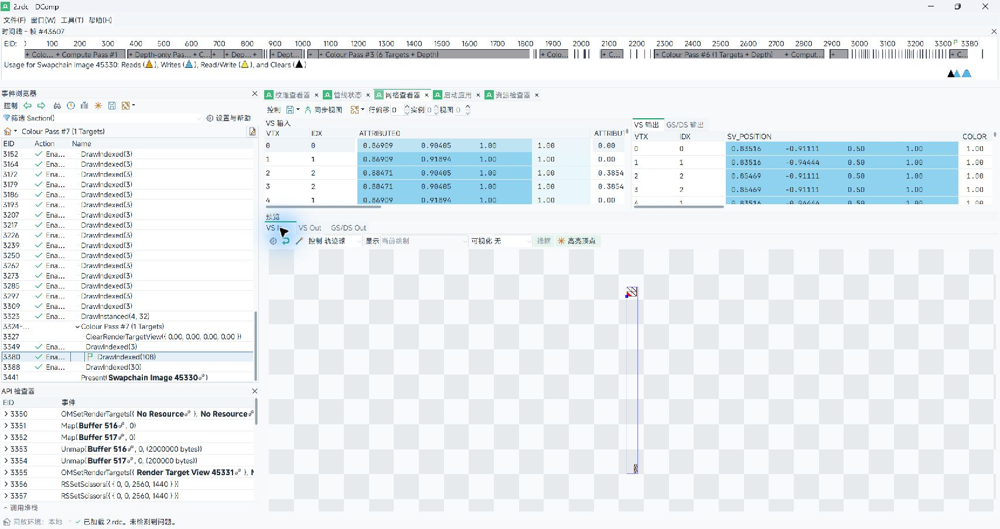
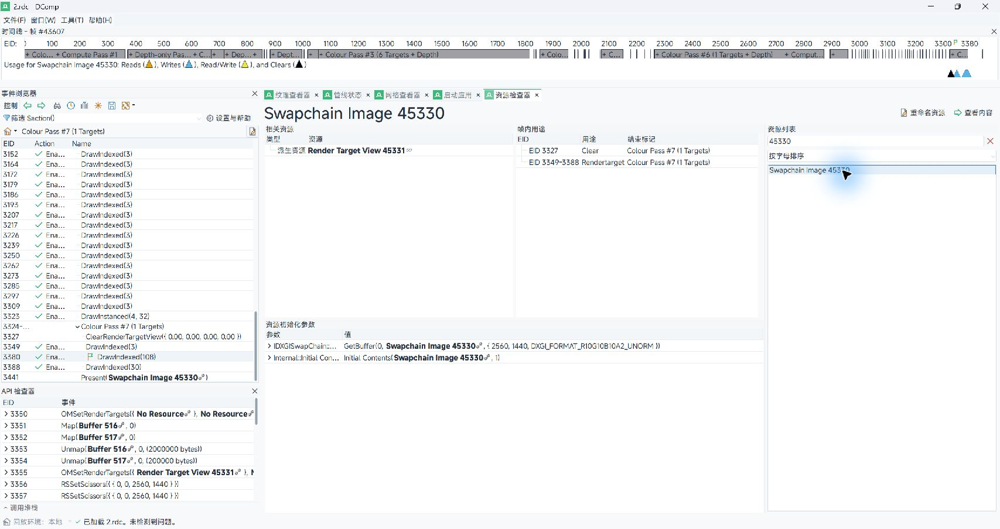

<h1 align="center">RenderDox</h1>

<p align="center">
  A Windows-focused RenderDoc derivative for reproducible builds, early graphics capture, and focused replay analysis.
</p>

<p align="center">
  <a href="LICENSE.md"></a>
  <a href="https://github.com/baldurk/renderdoc/tree/v1.x"></a>
  <a href="https://github.com/dotm5/renderdox/actions/workflows/cmake.yml"></a>
  <a href="https://github.com/dotm5/renderdox/actions/workflows/msbuild.yml"></a>
  <a href="https://github.com/dotm5/renderdox/releases"></a>
</p>

RenderDox is a downstream branch of [RenderDoc](https://github.com/baldurk/renderdoc), the frame-capture graphics debugger for Vulkan, D3D11, D3D12, OpenGL, and OpenGL ES. The repository name is **RenderDox**; its isolated Windows runtime and desktop application are branded **DComp** and **DCompUI**.

The project keeps RenderDoc's capture-and-replay architecture and `.rdc` workflow while adding a reproducible Windows release matrix, an isolated runtime identity, two early-capture deployment paths, controlled child-process propagation, and a modern localized desktop interface. It is independently maintained and is not supported by the upstream RenderDoc maintainers.

Use RenderDox only with software you own or are explicitly authorised to analyse. It does not provide or document protection bypasses.

Screenshots
-----------

The screenshots below follow one normal replay workflow in DCompUI: load the same D3D11 capture, select a draw event, inspect its output and pipeline, examine the mesh data, and follow the swap-chain resource. They use the Modern Light interface with the bundled Chinese translation.

| [](docs/imgs/Screenshots/DCompTextureViewer.jpg) | [](docs/imgs/Screenshots/DCompPipelineState.jpg) |
| --- | --- |
| **Texture Viewer** — replayed output and pixel context | **Pipeline State** — input layout and graphics stages |
| [](docs/imgs/Screenshots/DCompMeshViewer.jpg) | [](docs/imgs/Screenshots/DCompResourceInspector.jpg) |
| **Mesh Viewer** — vertex input/output inspection at the selected draw | **Resource Inspector** — swap-chain creation, use, and capture metadata |

What differs from upstream RenderDoc
------------------------------------

The graphics capture and replay implementation remains upstream-derived. The main downstream differences are deliberately concentrated around Windows identity, deployment, build reproducibility, and analysis presentation.

| Area | Upstream RenderDoc | RenderDox / DComp |
| --- | --- | --- |
| Baseline | General-purpose upstream project | Maintained downstream line that tracks reviewed RenderDoc `v1.x` sync points |
| Runtime identity | `renderdoc.dll`, `qrenderdoc.exe`, `renderdoccmd.exe` | `dgcore.dll`, `dgcoreui.exe`, `dgcorecmd.exe`, `dgcorestub.exe`, and `dgcoreshim32/64.dll` |
| Runtime API | `RENDERDOC_GetAPI` | Isolated `DCOMP_GetAPI` entry point; the upstream runtime export is intentionally absent |
| Windows releases | Upstream build and installer layouts | Complete x64 MSVC and ClangCL portable packages from one source commit, with manifests and contract checks |
| Injected runtime | Upstream configuration | Static MSVC runtime for `dgcore.dll`, the injection shim, and optional bootstrap DLLs |
| Early capture | Standard launch, inject, and attach paths | Standard paths plus an opt-in DXGI/D3D import bootstrap and tool-agnostic direct DLL injection |
| Child processes | Standard capture option | Reproducible one-generation default or all-generation propagation selected at build time |
| Desktop UI | Upstream QRenderDoc interface | DComp identity, Modern Light styling, modern icon states, Chinese localisation, and compact pipeline/capture summaries |
| Analysis extensions | Built-in replay UI and APIs | Read-only capture health/pass analysis, structured table export, action visibility, and evidence-package tooling |

The `.rdc` format, Qt/Python replay components, and most user-facing replay concepts intentionally stay close to upstream. A capture should still be replayed with a compatible DComp or RenderDoc build; downstream and future upstream versions are not assumed to be interchangeable without testing.

Capture workflows
-----------------

RenderDox supports two distinct Windows activation routes. Use one route per run so that loading and hook timing remain easy to diagnose.

### 1. DXGI import bootstrap

This route is useful when an owned application follows the normal Windows DLL search path and must load the capture runtime before its first DXGI/D3D call. The bootstrap DLLs are optional, are not part of the default solution graph, and remain plain System32 forwarders unless explicitly enabled.

Build a package with the bootstrap projects:

```powershell
pwsh -NoLogo -NoProfile -NonInteractive -ExecutionPolicy Bypass `
  -File .\util\buildscripts\build_windows_release_matrix.ps1 `
  -Target Rebuild -ChildPropagation OneGeneration -IncludeBootstrap
```

Copy matching-architecture files from one package next to the application executable:

| RHI | Required files |
| --- | --- |
| D3D11 | `bootstrap\dxgi_proxy\dxgi.dll`, `bootstrap\d3d11_proxy\d3d11.dll`, and `dgcore.dll` |
| D3D12 | `bootstrap\dxgi_proxy\dxgi.dll`, `bootstrap\d3d12_proxy\d3d12.dll`, and `dgcore.dll` |

Enable the bootstrap in the environment inherited by the application:

```powershell
$env:DCOMP_BOOTSTRAP_ENABLE = '1'
$env:DCOMP_BOOTSTRAP_LOG = 'C:\Temp\dcomp-bootstrap.log' # optional absolute path
.\OwnedApplication.exe
```

After DComp reports an active graphics API, open `dgcoreui.exe` and attach to the running instance. Remove the local proxy DLLs and environment variables when the test is complete.

This workflow only applies when the target actually resolves the local DXGI/D3D import path. A custom loader, private graphics function table, or different RHI path can bypass the bootstrap; use direct injection instead of adding application-specific logic to the proxies. Export names and ordinals are tied to the build machine's Windows baseline, so packages for a different Windows generation must be revalidated against its System32 DLLs.

See [bootstrap/README.md](bootstrap/README.md) for the loader-safety and fallback contracts.

### 2. Early direct injection

This route loads `dgcore.dll` into the real rendering process with an existing user-mode loader, debugger, or suspended-start launcher. The portable package does not require a particular injector.

1. Select a `dgcore.dll` whose architecture and source build match the DCompUI package.
2. Start or suspend the real rendering process early enough that DXGI/D3D factory, device, queue, and swap-chain creation have not completed.
3. Load `dgcore.dll`, verify that the operation succeeded, and then resume the process.
4. Start `dgcoreui.exe` from the same package and attach to the running instance.
5. Confirm an active API or overlay and a working control connection before requesting a capture.

For a launcher that creates one rendering child, the default `OneGeneration` build propagates capture once and stops there. Use `AllGenerations` only for an owned process tree that genuinely requires recursive propagation:

```powershell
pwsh -NoLogo -NoProfile -NonInteractive -ExecutionPolicy Bypass `
  -File .\util\buildscripts\build_windows_release_matrix.ps1 `
  -Target Rebuild -ChildPropagation AllGenerations
```

A loaded module is not proof that capture is ready: the graphics hooks, target-control channel, active API registration, and replayable `.rdc` output are separate checkpoints. Cross-bitness child injection also requires the matching 32-bit components.

Builds
------

The supported downstream Windows release boundary is the complete x64 MSVC/ClangCL matrix:

```powershell
pwsh -NoLogo -NoProfile -NonInteractive -ExecutionPolicy Bypass `
  -File .\util\buildscripts\build_windows_release_matrix.ps1 `
  -Target Rebuild -ChildPropagation OneGeneration
```

Unless `-OutputDirectory` is supplied, the script creates a timestamped directory under the sibling `artifacts` directory. It produces:

- `msvc-release` — Visual C++ v143 Release package.
- `clangcl-release` — ClangCL Release package with isolated outputs.
- `manifest.json` — source commit, toolchain, file size, and SHA-256 inventory.

Each package contains the GUI, command-line tools, capture runtime, injection shim, Qt plugins, Python runtime, Python modules, Vulkan descriptor, and symbol helpers. `-IncludeBootstrap` adds the optional DXGI, D3D11, and D3D12 bootstrap outputs.

For a single toolchain, use `util/buildscripts/build_windows_release.ps1`. The scripts validate product identity, exports, embedded DXIL, static-runtime requirements for injected components, Vulkan descriptor identity, required runtime files, and optional bootstrap exports before declaring success.

Every successful `dgcore-main` push is released automatically after both the CMake and MSBuild workflows validate the same commit. The [continuous pre-release](https://github.com/dotm5/renderdox/releases) contains matching x64 MSVC and ClangCL archives, a complete manifest, SHA-256 checksums, and GitHub build-provenance attestations. Pull requests and manually dispatched builds remain validation-only and never publish a release.

See [Compiling.md](docs/CONTRIBUTING/Compiling.md) for upstream prerequisites and platform notes.

API support
-----------

| | Windows | Linux | Android |
| --- | --- | --- | --- |
| Vulkan | :heavy_check_mark: | :heavy_check_mark: | :heavy_check_mark: |
| OpenGL ES 2.0 - 3.2 | :heavy_check_mark: | :heavy_check_mark: | :heavy_check_mark: |
| OpenGL 3.2 - 4.6 Core | :heavy_check_mark: | :heavy_check_mark: | N/A |
| D3D11 & D3D12 | :heavy_check_mark: | N/A | N/A |
| OpenGL 1.0 - 2.0 Compat | :heavy_multiplication_x: | :heavy_multiplication_x: | N/A |
| D3D9 & D3D10 | :heavy_multiplication_x: | N/A | N/A |
| Metal | N/A | N/A | N/A |

Nintendo Switch&trade; support is distributed separately to authorised developers as part of the NintendoSDK. Consult the Nintendo Developer Portal for details.

Repository lines
----------------

- `dgcore-main` is the maintained RenderDox branch and the default branch of this repository.
- `v1.x` follows the upstream RenderDoc line without downstream product changes.
- `archive/fullstack-v145` preserves the earlier full-stack implementation as reference material.

Downstream changes should remain reviewable as focused commits on top of the upstream baseline. Product identity is generated from [build/product_identity.json](build/product_identity.json); new code should consume that contract instead of scattering additional names through the tree.

Documentation and support
-------------------------

- RenderDox issues: [github.com/dotm5/renderdox/issues](https://github.com/dotm5/renderdox/issues)
- Upstream RenderDoc: [repository](https://github.com/baldurk/renderdoc), [documentation](https://renderdoc.org/docs), and [builds](https://renderdoc.org/builds)
- Contribution guide: [docs/CONTRIBUTING.md](docs/CONTRIBUTING.md)
- Code of Conduct: [docs/CODE_OF_CONDUCT.md](docs/CODE_OF_CONDUCT.md)
- Upstream extensions: [renderdoc-contrib](https://github.com/baldurk/renderdoc-contrib)

License
-------

RenderDox is derived from RenderDoc and is distributed under the MIT license. See [LICENSE.md](LICENSE.md) for the full text and third-party acknowledgements.
