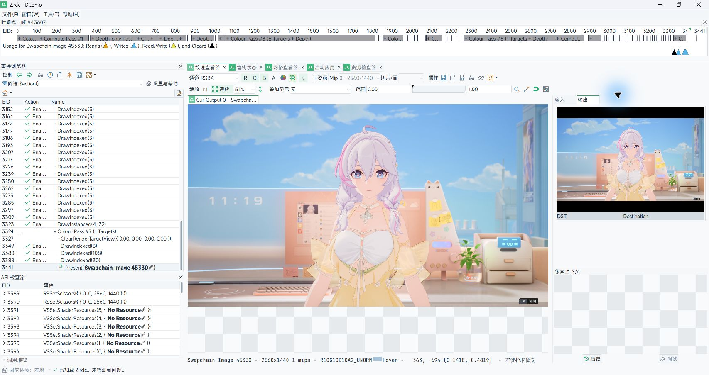
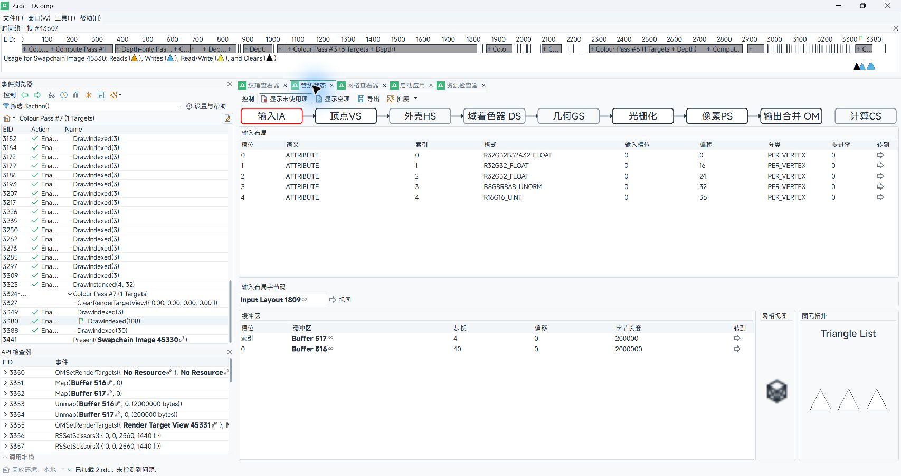
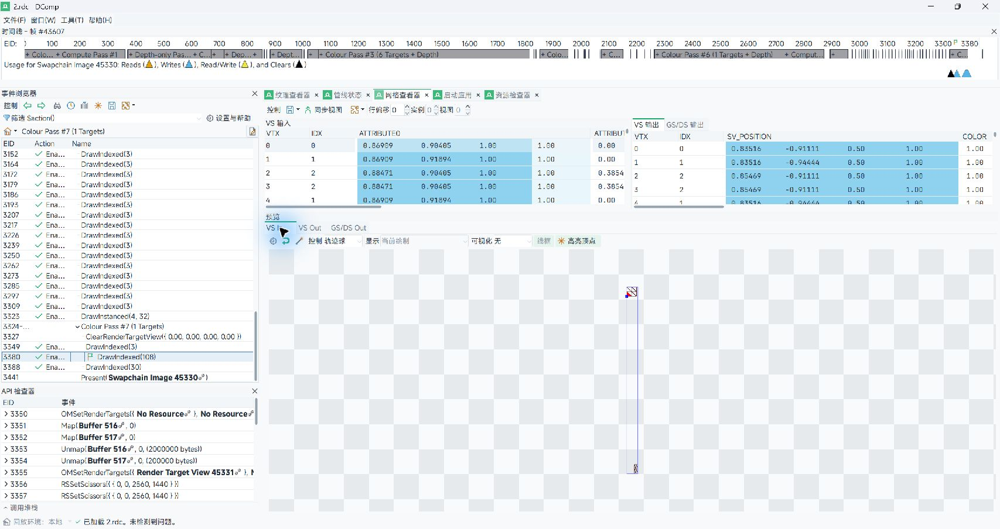
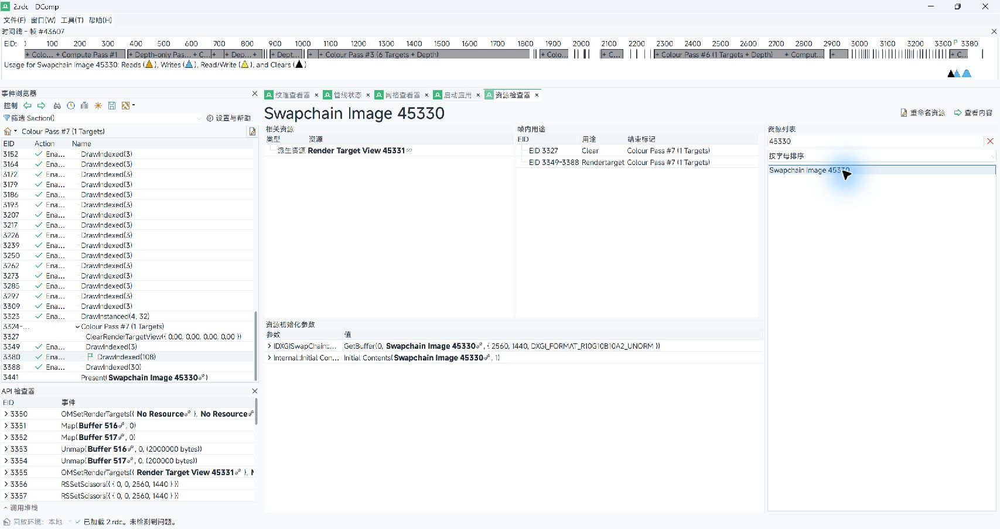
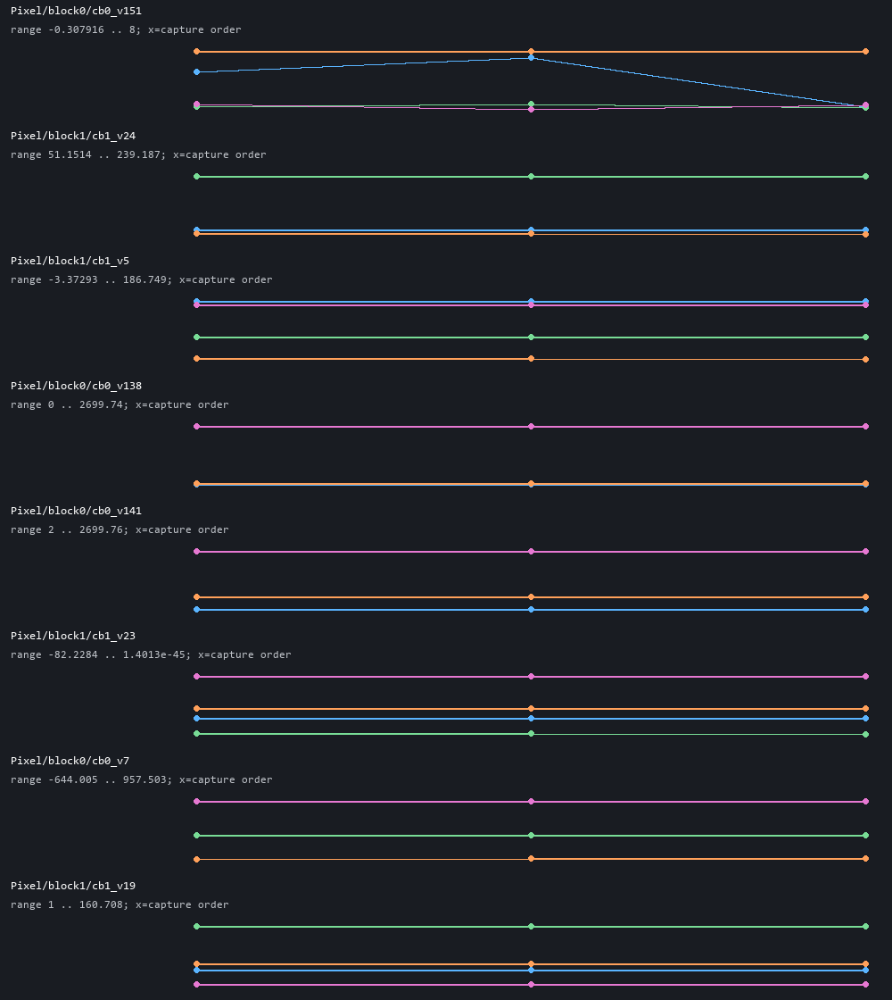

<h1 align="center">RenderDox</h1>

  A Windows-focused RenderDoc derivative for reproducible builds, early graphics capture, and focused replay analysis.

  
  
  
  
  

RenderDox is a Windows-focused fork of [RenderDoc](https://github.com/baldurk/renderdoc) for graphics capture and replay, with an enhanced desktop interface, early capture options, and LLM-driven analysis. Its isolated runtime and desktop application are branded **DComp** and **DCompUI**.

The current baseline is **RenderDoc v1.46**, with upstream maintenance integrated through [`36b1c78ec`](https://github.com/baldurk/renderdoc/commit/36b1c78ec7df44b2945c3c360ba8f4cc445eb060). RenderDox is independently maintained and keeps the upstream `.rdc` capture workflow.

  <a href="https://github.com/dotm5/renderdox/releases">Download portable releases</a> ·
  <a href="USAGE.md">Usage guide</a> ·
  <a href="tools/renderdoc-mcp/README.md">MCP reference</a> ·
  <a href="#screenshots">Screenshots</a>

Features
--------

| Area | What RenderDox adds |
| --- | --- |
| Desktop interface | Modern Light styling, modern icon states, Chinese localisation, and compact capture and pipeline summaries |
| Early capture | Optional DXGI, D3D11, D3D12 and x64 Aftermath proxies, direct injection, and child-process propagation |
| Windows hook performance | SafetyHook and Zydis, indexed GetProcAddress lookups, and direct proxy forwarding after initialization |
| Portable distribution | Complete Windows x64 MSVC and ClangCL packages with Python, PySide2/Shiboken2, Qt plugins, MCP and all four bootstrap DLLs |
| MCP capture and replay | 66 tools for target discovery, runtime capture sequences, replay inspection, shader/mesh/texture queries and pixel history |
| Cross-capture investigation | EID and resource alignment, numeric output Diff, draw contribution images, GPU counters and constant timelines |
| Analysis export | Capture/pass analysis, persistent annotations, structured evidence, and Markdown/JSON/ZIP export |

The MCP layer uses public replay and target-control APIs in separate workers, keeping integration outside native RenderDoc data structures. D3D11, D3D12, Vulkan, OpenGL and OpenGL ES capture support remains upstream-derived; individual analysis tools depend on the replay backend.

Screenshots
-----------

### Desktop replay

The screenshots below follow one normal replay workflow in DCompUI: load the same D3D11 capture, select a draw event, inspect its output and pipeline, examine the mesh data, and follow the swap-chain resource. They use the Modern Light interface with the bundled Chinese translation.

|  |  |
| --- | --- |
| **Texture Viewer** — replayed output and pixel context | **Pipeline State** — input layout and graphics stages |
|  |  |
| **Mesh Viewer** — vertex input/output inspection at the selected draw | **Resource Inspector** — swap-chain creation, use, and capture metadata |

### MCP analysis outputs

These images were generated by the portable MCP 0.2.0 service from a real D3D11 capture session on 2026-09-30. Click an image to inspect it at full resolution.

|  |  |
| --- | --- |
| **Draw contribution** — highlighted output changes from one selected draw | **Numeric change mask** — the same draw changes 61,385 pixels in the selected output; white marks changed pixels |

The mask shows changes in the selected output, rather than a segmentation of the entire character.

Across captures: inspect changing shader constants

Aligned draws reveal changing shader constants across three captures. The horizontal axis is capture order; each variable has its own printed vertical range. Exact values are available in JSON and CSV exports.

Download and documentation
--------------------------

The [portable releases](https://github.com/dotm5/renderdox/releases) provide matching Windows x64 MSVC and ClangCL ZIPs, file manifests and checksums. The complete packages include their desktop and MCP dependencies; no MSI or system Python installation is needed.

| Guide | Contents |
| --- | --- |
| [Using RenderDox](USAGE.md) | First run, package layout, proxy/direct injection, MCP setup and release builds |
| [Bootstrap reference](bootstrap/README.md) | Proxy deployment, activation and forwarding behavior |
| [Portable MCP reference](tools/renderdoc-mcp/README.md) | Tool parameters, capture jobs, Diff, alignment and optional GUI bridge |
| [Windows build scripts](util/buildscripts/README.md) | Build and packaging commands |

Project and upstream
--------------------

- [RenderDox issues](https://github.com/dotm5/renderdox/issues)
- Upstream RenderDoc: [repository](https://github.com/baldurk/renderdoc) · [documentation](https://renderdoc.org/docs)
- [Development notes](docs/CONTRIBUTING.md)

License
-------

RenderDox is derived from RenderDoc and distributed under the MIT license. See [LICENSE.md](LICENSE.md) for the full text and third-party acknowledgements.
