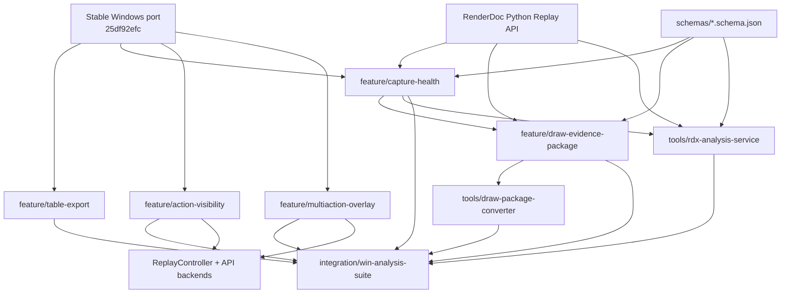
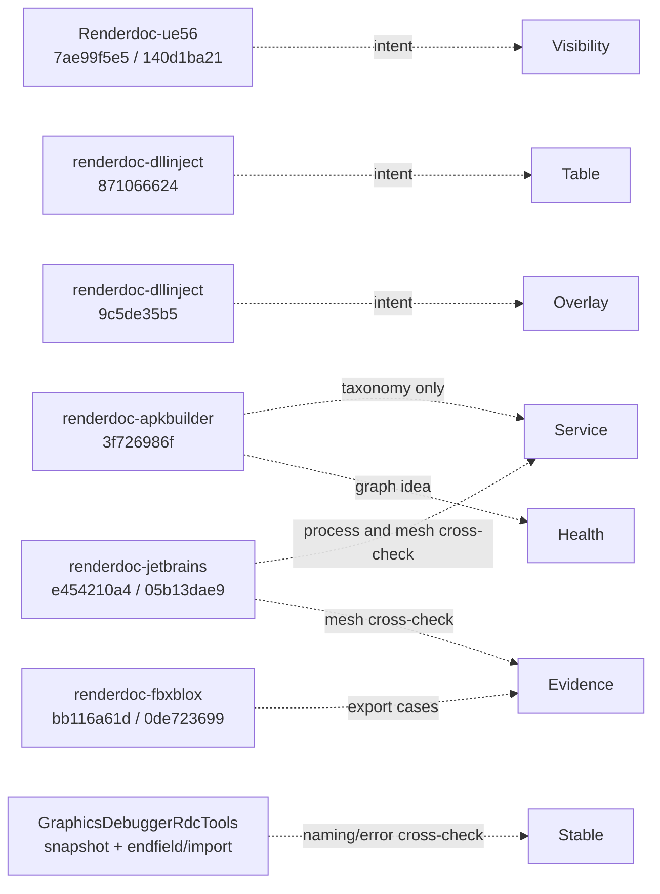

# Windows analysis-suite dependency graph

## Build and runtime graph



## Layer ownership

| Component | Owns | Depends on | Must not depend on |
| --- | --- | --- | --- |
| Structured table export | Model selection serialization and UI actions | Qt model/view, QSaveFile | Replay backend, donor code |
| Capture Health | Open/replay metrics, CSV/JSON summaries | Python Replay API, schemas | QRenderDoc UI |
| Pass Graph | Resource edges and structural signatures | Capture Health data adapter | Event marker names as identity |
| Action Visibility | Eligibility UI, presets, session override | CaptureContext, ReplayController, backend draw wrappers | RDC serialisation |
| MultiAction overlay | Parent/child map and aggregate overlay | CaptureContext, ReplayOutput, backend overlay | Action Visibility preset format |
| Evidence exporter | Geometry/shader/pipeline/texture package | Replay API, GLB writer, schemas | FBX SDK |
| RDX service | Read-only request routing and worker lifecycle | Health, pass graph, evidence modules | Target launch/injection, mutation |
| Converter | Package validation and optional conversion handoff | Evidence schema and GLB | RenderDoc Core/QRenderDoc |

## Donor evidence graph



Dashed edges are evidence relationships, not source or binary dependencies.

## Data flow

```text
RDC
 ├─ SHA-256 and open/replay status
 ├─ actions and action signatures
 ├─ resources and usages
 ├─ shaders and reflection
 ├─ pipeline state
 ├─ buffers/post-VS
 └─ textures/outputs
        │
        ├─ capture-health.{json,csv}
        ├─ pass-graph.json
        ├─ action-signatures.json
        └─ frame_or_draw_<capture>_<eid>/
              ├─ manifest/action/provenance
              ├─ geometry GLB + raw
              ├─ shaders/reflection/disassembly
              ├─ pipeline/descriptors
              ├─ constants
              ├─ lossless textures
              └─ outputs
```

## Test dependencies

| Gate | Inputs | Required before |
| --- | --- | --- |
| Pure Python unit tests | Synthetic actions/resources/tables/geometry | Any replay integration |
| Schema validation | Synthetic valid/invalid documents | Health/evidence/service acceptance |
| Table serializer tests | Synthetic Qt models and proxy models | QRenderDoc feature merge |
| Frozen capture health | D3D11/D3D12/OpenGL/Vulkan/UE5 RDCs | Service/evidence integration |
| Visibility tests | Owned direct/indexed/risky draw scenes | Visibility merge |
| MultiAction tests | Owned D3D12 ExecuteIndirect and Vulkan multi-draw | Overlay merge |
| GLB validator | Exported input and post-VS GLBs | Evidence merge |
| Blender background import | Validated GLBs | Evidence acceptance |
| Development/Release rebuild | Integrated source | Final regression |
| Cross-API replay | Frozen RDC set and fresh owned captures | Final acceptance |

## Dependency policy

- Runtime Python code uses the standard library plus the `renderdoc` module
  produced by the current build.
- No donor Python environment, lock file, database, binary, or generated
  catalog is reused.
- No FBX SDK is linked to RenderDoc or QRenderDoc.
- Optional format validators or Blender are test tools, not runtime
  dependencies.
- New dependencies require an explicit lock record and license entry. The
  selected initial implementation adds no third-party runtime dependency.
