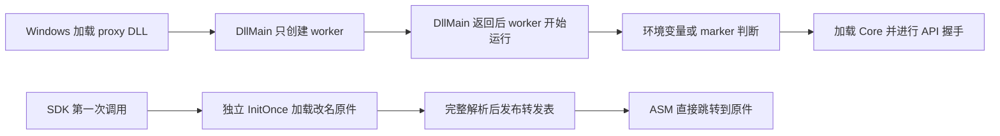

# Proxy Builder 0.4.1：按专用 Aftermath 架构修正

2026-10-01。源码：`tools/proxy-builder`。证据与交付：
`D:\rdoc-port\artifacts\proxy-builder-041-20261001`。

## 底层差异与修正

专用实现位于 `bootstrap/aftermath_proxy/dllmain.cpp`、`aftermath_forward.cpp`、
`aftermath_forward.asm`。其启动和转发是两条独立流程：



SDK 调用不作为 Core 启动条件。不在 DllMain 中读文件、加载原件、加载 Core、
调用 GetAPI 或执行插件初始化；worker 在 loader unlock 后执行这些操作。

0.4.0 把统一路径默认设成 first-call，并一直保留 `g_ResolutionReady=0`。
前者让 Core 激活依赖 SDK 导出调用，后者让每个转发都进入 C++ resolver。
SDK 作为加载槽时，即使 DLL 被加载，也可能暂时没有导出调用；启动不能依赖这件事。
此外，requireCore 在 Core 自身的握手重入时将初始化中状态判断为失败。

0.4.1 将查询协议与启动策略分别处理：

|修正|最终行为|
|---|---|
|加载槽默认策略|Aftermath、generic、NGX、NVAPI 和普通系统加载槽默认 worker；图形 provider 默认 first-call；显式 activation 始终优先|
|Aftermath 自动识别|DLL basename 与 GFSDK 导出共同匹配；auto 选择 aftermath profile，无需额外 JSON|
|旧调用兼容|Aftermath 即使用旧 streamline profile 仍按 SDK 加载槽启动；streamline-bootstrap route 也默认 worker|
|原件兼容|默认标准 orig 名及两个历史改名；仅文件不存在时尝试下一项；全部固定同一 SHA256|
|快路径|原件 InitOnce 完成并满足所需门槛后，Interlocked 发布 ASM 快路径；export 模式保留每次触发检查|
|初始化重入|Core/插件重入只转发原件，不提前发布快路径；外部 requireCore 调用仍等待完整 Core/插件初始化|
|启动失败|线程创建失败记录状态和错误；原件/导出缺失继续明确失败，不返回伪造成功|
|生产编译|明确启用优化；保留 x64 参数保存、shadow space、XMM、栈参数、尾跳转和 unwind 元数据|

继续保留精确输入名称、ordinal-only、别名和 DATA 契约，不把未知签名的 43-name union
强行补入一个只有 9 个原始导出的 DLL。专用 union 实现保持独立。

## 可复现证据

|验证|结果|证据|
|---|---|---|
|单元测试|25/25 通过|`unit-final.log`|
|MSVC/ClangCL 路径验收|66/66 通过|`routes-verified/results.json`|
|同 DLL NVAPI/Vulkan 分发|2/2 通过|`mixed-verified/results.json`|
|并发 ABI/raw EAT|512,000 次调用、8 个进程、16 线程/进程、零错误|`abi-verified/*/smoke*.json`|
|仅加载、无 SDK 调用|Core 已握手，原件仍未加载|generic/NGX/NVAPI/Aftermath load-only 用例|
|慢 Core 握手|握手被事件阻塞期间，普通 SDK 调用仍能正确转发|`worker-no-block` 用例|
|原件改名与哈希|三个改名通过；坏的已存在原件不会被正确备选掩盖|`aftermath-rename-*`、`aftermath-bad-primary`|
|重入及失败门槛|有效重入通过；失败 Core/插件仍得到预期 fail-fast|`reentrant-core`、`reentrant-core-fail`、`required-worker-plugin-fail`|
|旧/新 A/B|旧版纯加载不激活；旧版 required-Core 重入 fail-fast；新版对应测试通过|`FROZEN-AND-BASELINE.json`|
|最终便携包真实原件|两个编译器均 auto 识别 aftermath、选择 worker、验证精确契约|`Aftermath-auto-*-待运行时验证/build-result.json`|
|真实 Core 自有进程|两个产物均在无 Aftermath 函数调用时达到 state=2、lastError=0|`real-core-*.json`|

这轮验收使用独立进程和明确输入，不修改正在运行的游戏。

## 运行时边界

上一轮游戏 PID 42708 没有捕获目标，未生成 RDC；模块枚举返回错误 5。
游戏二进制的九个 Aftermath delay-import 名称与输入原件契约一致。
因此没有直接证明当时的 proxy 是否映射、导出是否被调用、Core 是否加载失败，
也不能将自有进程中的 A/B 结果当成该游戏唯一根因的证明。

本轮已经修正可复现的架构错误。worker 仍是异步启动，不承诺早于所有设备创建；
只有 DLL 被实际加载，worker 才能运行。真实游戏需要重新部署候选、启动新实例，再验证
加载链、设备包装、单帧 RDC 和回放。现有 enable marker 与环境变量规则保持明确优先级。

交付包自带 Python，构建需要 Visual Studio C++/MASM。新默认使用示例：

```powershell
proxy-builder.exe build D:\original\GFSDK_Aftermath_Lib.x64.dll --output D:\build\aftermath-041 --copy-original --core D:\DComp\dgcore.dll --enable-core
```

配置、其他路径和 DATA/linker 边界见 [ROUTES.md](../tools/proxy-builder/ROUTES.md)。
